La página de "**Objects dictionary**" ofrece un listado completo de todos los elementos del Sistema analizado, donde se muestran las características principales de cada uno de ellos. Cuenta con tres secciones denominadas: "**System dictionary**", "**Current selection**", "**Groups**" que serán explicadas posteriormente a lo largo de este manual.

Se puede acceder a esta página seleccionando la opción "**Objects dictionary**" de la droplist "**Options**".

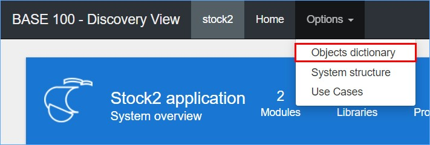

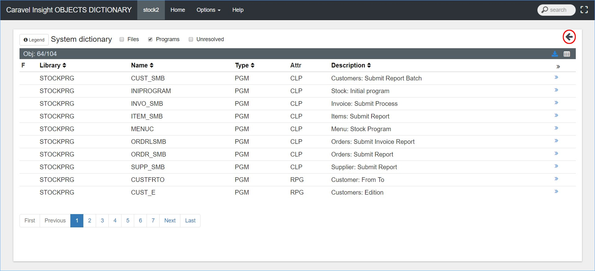

Además del contenido de esta página, se puede observar que en el "**Menú principal**" se ha añadido un cuadro de búsqueda. Este "**Cuadro de búsqueda**" permite encontrar elementos del Sistema mediante criterios como: nombre del elemento, librería al que pertenece, descripción, tipo, etc.

Se puede observar también que, al entrar en esta página por omisión se muestra la sección "**System dictionary**", mientras que las secciones "**Current selection**" y "**Groups**" están ocultas. Para mostrar estas dos últimas se debe pulsar sobre el icono  ubicado en la esquina superior derecha de esta sección.

El concepto de Grupo, que aparece en esta página se utiliza a lo largo de todo el **_Visor Discovery_**. Se refiere a una agrupación de elementos con características comunes o de conveniencia, que se han asociado para tratarse como un conjunto. Un elemento puede pertenecer a uno o más Grupos.

## System dictionary

La sección "**System dictionary**" muestra una lista en formato de tabla con información de los elementos que conforman el Sistema.

Las casillas de verificación situadas en la parte superior de esta sección, permiten filtrar el tipo de elemento que se visualizan en dicha tabla, estos elementos pueden ser: ficheros (Files), programas (Programs) y elementos sin resolver (Unresolved).

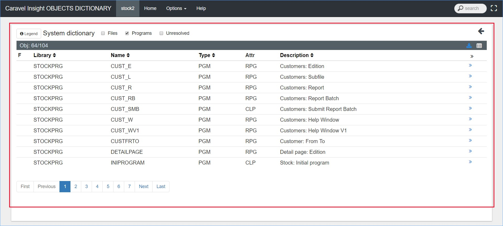  
Las flechas situadas a la derecha del nombre permiten ordenar alfabéticamente los elementos de la tabla.

Los encabezados de esta tabla, significan lo siguiente:

*   **F**. Función del elemento (Service server y Service client).
*   **Library**. Nombre de la librería que pertenece el elemento.
*   **Nombre**. Nombre del elemento.
*   **Type**. Calificativo del elemento, pueden ser: programas (PGM), fichero (FILE), menús (MENU), etc.
*   **Attr**. Según el tipo (type) del elemento, se define la característica propia del mismo.
*   **Description**. Breve descripción de la función del elemento.
*   .Al pulsar este botón, los elementos que se muestran en la página serán enviados a la sección "**Current selection**"; mientras que al pulsar el botón  se envía únicamente el elemento correspondiente. Se explicará en detalle dentro de la sección "**Current selection**".

Los botones de navegación situados al pie de la tabla funcionan de la siguiente forma:

*   **First**. Accede a la primera página del listado.
*   **Previous**. Accede a la página anterior.
*   **1...10**. Permiten acceder a una página en concreto.
*   **Next**. Accede a la página siguiente.
*   **Last**. Accede a la última página de la tabla.

### Download all Objects

Al pulsar el botón  ubicado en la parte superior derecha de la tabla de catálogo, se descargará un archivo en formato Excel con información correspondiente a los elementos del Sistema. Este archivo resulta útil ya que puede ser manejado con más facilidad mejorando significativamente el análisis de los mismos. A continuación, se muestra un ejemplo:

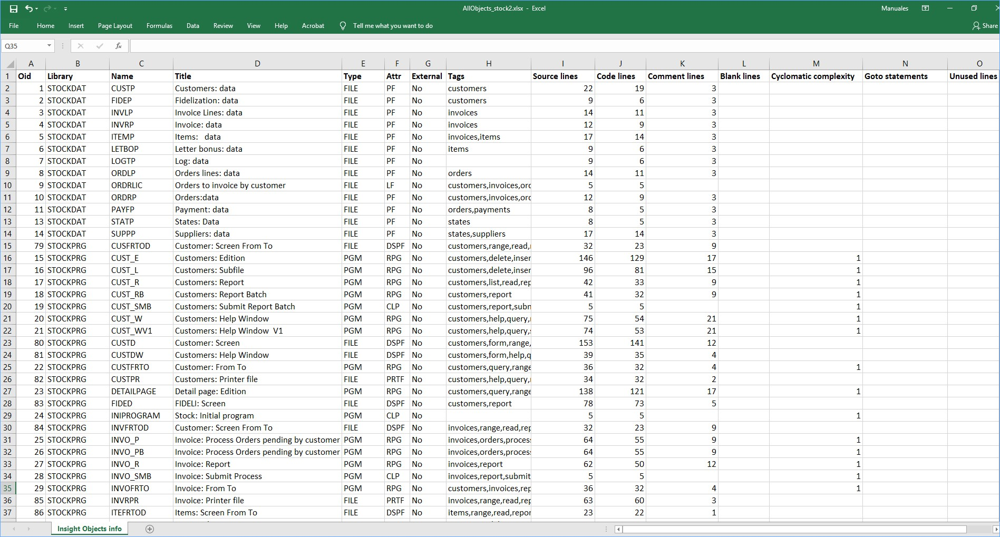

Como se puede observar la información que se muestra en el archivo, cambia significativamente con la que se presentan en la sección "**System dictionary**" siendo esta la versión extendida. A continuación, se explican los encabezados de esta tabla:

*   **Oid**. Es un identificador único para el elemento.
*   **Library**. Nombre de la librería que pertenece el elemento.
*   **Name**. Nombre del elemento.
*   **Title**. Texto descriptivo que hace referencia a la funcionalidad del elemento.
*   **Type**. Según sus características, se muestra el tipo del elemento.
*   **Attr**. En dependencia del tipo y lenguaje de creación del elemento, se definen los atributos del mismo.
*   **External**. Se refiere a los componentes que, perteneciendo al Sistema, no están sin embargo incluidos en un determinado Subsistema, por lo que son externos a éste.
*   **Tags**. Las etiquetas son indicativos que se pueden poner a los elementos para marcar por ejemplos aquellos elementos que van dirigidos a un campo en específico. Este campo muestra las etiquetas que tiene el elemento, es importante decir que un elemento puede tener varias etiquetas.
*   **Sources lines**. Cantidad total de líneas utilizadas para la creación del elemento.
*   **Code lines**. Líneas totales de código de programación.
*   **Comment lines**. Se cuentan todas las líneas que contengan los caracteres que el Sistema identifique como comentario, incluso si después no hay una frase definida.
*   **Blank lines**. Total, de líneas en blanco en la composición del elemento.
*   **Cyclomatic complexity**. Este campo solo se mostrará para los elementos de tipos de programas, y se refiere al número de alternativas en el flujo del programa. Se obtiene como el número de decisiones binarias en el programa más uno. Para calcular el número de decisiones binarias se realiza un conteo de todas las instrucciones que presentan alternativas de ejecución basándose en condiciones: IF*, WH* (RPG), IF, MONMSG (CL), etc.
*   **Goto statements**. Instrucciones Goto en la estructura del elemento.
*   **Unused lines**. Líneas que no son invocadas o utilizadas por el elemento.

## Current Selection

Es una sección dedicada al tránsito temporal de elementos, y que está orientada a la creación, edición y visualización de Grupos en el Sistema. Diversas funcionalidades la acompañan, mejorando y facilitando estas tareas. La sección por omisión se encuentra oculta, para mostrarla hay que pulsar el icono , como se observa en la imagen siguiente:

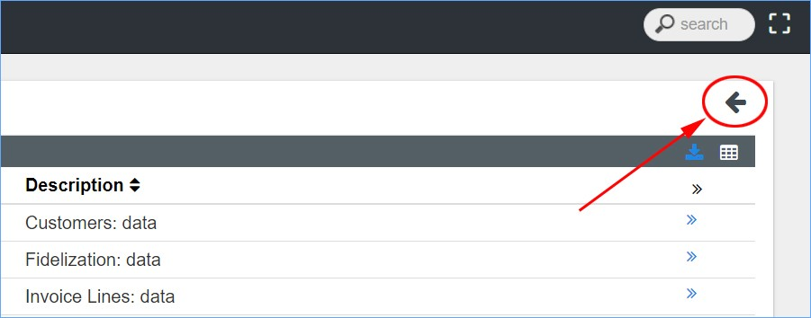

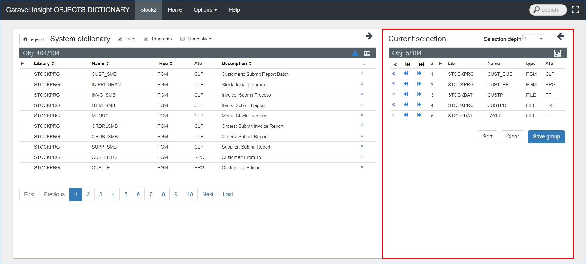

El campo "**Selection depth**" que se puede observar en la esquina superior derecha, permite definir a que nivel (0, 1, 2, 3, All) se importarán las relaciones de los elementos, es decir "precedencias" y "dependencias". A continuación, se explican las funcionalidades de los botones en esta sección:

*   . Retira los elementos de la sección.
*   . Al pulsar este botón, se importarán las precedencias de todos los elementos seleccionados, según el nivel definido.
*   . Al pulsar este botón, se importarán las dependencias de todos los elementos seleccionados, según el nivel definido.
*   **#**. Secuencia de elementos seleccionados.
*   **Lib**. Nombre de la librería que pertenece el elemento.
*   **Name**. Nombre del elemento.
*   **Type**. Calificativo del elemento, pueden ser: programas (PGM), ficheros (FILE), menús (MENU), etc.
*   **Attr**. Según el tipo (type) de elemento, se define la característica propia del mismo.

### Seleccionar elementos

Como se comentaba en la sección "**System dictionary**", se tendrá que pulsar el icono  para enviar un elemento en específico o el icono  para enviar los elementos que se muestran en la página.

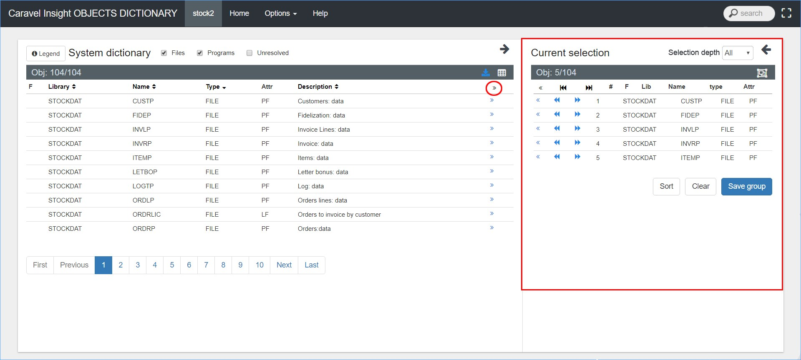

Como se puede observar, al seleccionar elementos aparecen nuevos botones que son los siguientes:

*   . Al pulsar este botón el elementos será retirado de la sección.
*   . Importa precedencias del elemento según el nivel seleccionado.
*   . Importa dependencias del elemento según el nivel seleccionado.
*   **Sort**. Ordena alfabéticamente los elementos según el nombre del elemento(Name).
*   **Clear**. Al pulsar este botón, se limpiará la sección dejándola vacía.
*   **Save a Group**. Este botón permite crear un Grupo en el Sistema, a partir de los elementos seleccionados. A continuación, se explica en detalle.

### Creación de Grupos

Como se comentaba, para habilitar el botón "**Save a group**" que permite guardar Grupos en el Sistema se requiere tener elementos seleccionados en esta sección. Una vez se hayan seleccionado los elementos, se debe pulsar dicho botón y aparecerá la siguiente página emergente:

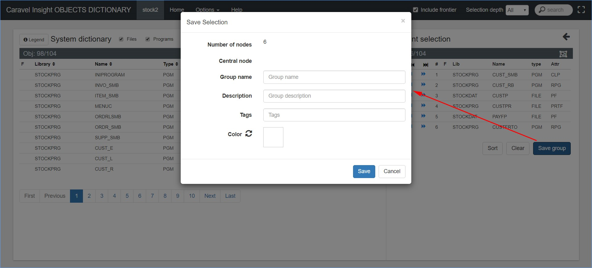

En la página emergente llamada "**Save selection**", se podrán definir datos descriptivos del Grupo, estos son los siguientes:

*   **Number of nodes**. Muestra la cantidad de elementos que contiene el Grupo.
*   **Central node**. Se refiere al elemento central o de referencia al Grupo.
*   **Group name**. Permite especificar el nombre del Grupo.
*   **Description**. Permite incluir una descripción del Grupo.
*   **Tags**. Este campo permite poner una etiqueta al Grupo, que será asociada a cada uno de sus elementos, de forma que cuando un elemento sea seleccionado mostrará todas las etiquetas vinculadas con cada Grupo. Un elemento puede pertenecer a varios Grupos.
*   **Color**. Permite definir un color al Grupo, de forma que cuando se visualicen los elementos en la página "**System structure**", se mostrarán con el color asignado. La página "**System structure**" se explicará a lo largo de este manual.

Una vez que se hayan introducido los datos relativos al Grupo se deberá pulsar sobre el botón "**Save**", siendo en ese momento el Grupo creado. Para cancelar o cerrar la página emergente se deberá pulsar sobre el botón "**Cancel**".

## Groups

En esta sección, se pueden observar todos los Grupos creados en el Sistema, también se pueden ejecutar acciones tales como: ver los elementos de cada Grupo, eliminar Grupos, descargar la información de uno o todos los Grupos, analizar por separado al resto del Sistema un Grupo en específico, y cargar desde local nuevos Grupos.

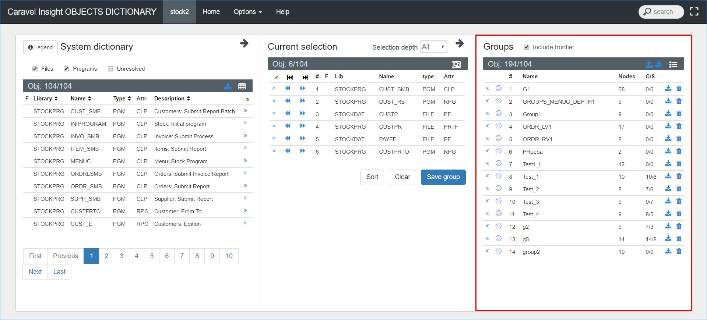

Los índices y botones de esta sección serán explicados a continuación:

*   **Include frontier**. Es una casilla de verificación que cumple con la función de incluir las fronteras de un Grupo al momento de analizar este en la página "**System structure**".
*   . Este botón permite descargar un archivo en formato Excel con información referente a la estructura de los Grupos creados en el Sistema. Al pulsar el icono situado al final del nombre de cada Grupo, se descargará la información específica de ese Grupo.
*   . Este botón permite cargar y actualizar los Grupos del Sistema. Se explicará más adelante.
*   . Este botón envía los elementos que pertenecen al Grupo a la sección "**Current selection**".
*   . Al pulsar este botón, crea un Subsistema a partir del Grupo, donde se podrá analizar aislado al resto del Sistema principal.
*   **#**. Cantidad de Grupos.
*   **Name**. Nombre del Grupo.
*   **Nodes**. Cantidad de elementos en cada Grupo.
*   **C/S**. Hace referencia al papel funcional de cada objeto, es decir "**C**" para aquellos elementos que son "Clientes de servicios" y "**S**" para aquellos elementos que son "Servidores de servicios". Se utiliza en este caso la analogía "**Cliente/Servidor**" habitual en Sistemas de tratamiento de información, identificando elementos que requieran datos o procesos de aquellos que los aportan.
*   . Al pulsar sobre este icono se borrará el Grupo correspondiente. Es importante decir que esta acción no se podrá deshacer.

### Archivo generado All Groups

Como se explicaba, al pulsar el botón  se descargará un archivo en formato Excel con la información detallada de todos los Grupos del Sistema. Tiene la siguiente apariencia:

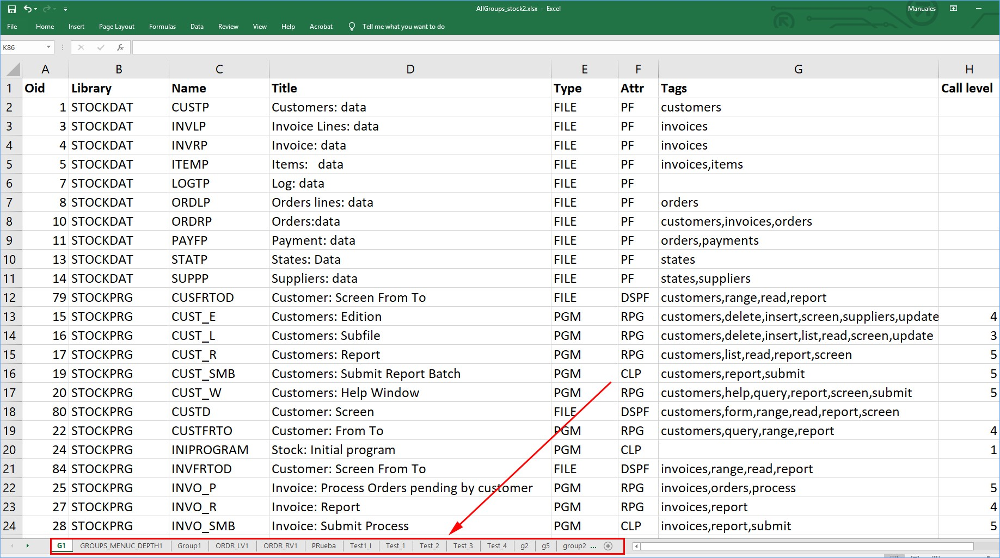

Las pestañas dentro del recuadro, son equivalente a un Grupo y son nombradas de la misma manera. Los encabezados de la tabla, significan lo siguiente:

*   **Oif**. Identificador (id) único del elemento.
*   **Library**. Nombre de la librería que pertenece al elemento.
*   **Name**. Nombre del elemento.
*   **Title**. Descripción breve de la función del elemento.
*   **Type**. Calificativo del elemento, pueden ser: programas (PGM), ficheros (FILE), menús (MENU), etc.
*   **Attr**. Según el tipo (type) de elemento, se define la característica propia del mismo.
*   **External**. Se refiere a los componentes que, perteneciendo al Sistema, no están sin embargo incluidos en un determinado Subsistema, por lo que son externos a éste.
*   **Tags**. Etiquetas del elemento.
*   **Call level**. Nivel de profundidad en referencia al elemento principal.

Para agregar un elemento al Grupo habrá que editar el archivo, se tendrá que rellenar correctamente cada columna con la información del elemento, igualmente se puede retirar un elemento borrando la información del mismo. Una vez las modificaciones hayan sido guardadas, se debe pulsar el botón  y elegir el archivo correspondiente. Para actualizar un Grupo es importante que este, sea eliminado del Sistema antes de subir el archivo, también hay que tener en cuenta que los nombres de los Grupos no podrán ser modificados.

Se pueden restaurar Grupos que fueron borrados, si antes se ha descargado este archivo y contenía información del Grupo que se quiera restaurar. Para hacerlo se debe seguir el mismo procedimiento, pulsando sobre el botón  y eligiendo el archivo correspondiente.

### Análisis independiente de Subsistemas

La sección "**Groups**" mediante el botón  permite analizar un Grupo de forma independiente, generando un Subsistema correspondiente al Grupo, donde el resto de componentes del Sistema principal no serán mostrados. Por otra parte, la casilla de verificación "**Include frontier**" permite también, enviar aquellos elementos que representan fronteras del Grupo, es decir elementos del Sistema que hacen referencia a elementos del Grupo o viceversa. Se explicará el término de "**Fronteras**" a lo largo de este manual.

La navegación, funciones, opciones y rendimiento de la herramienta seguirá siendo la misma, véase en las siguientes imágenes:

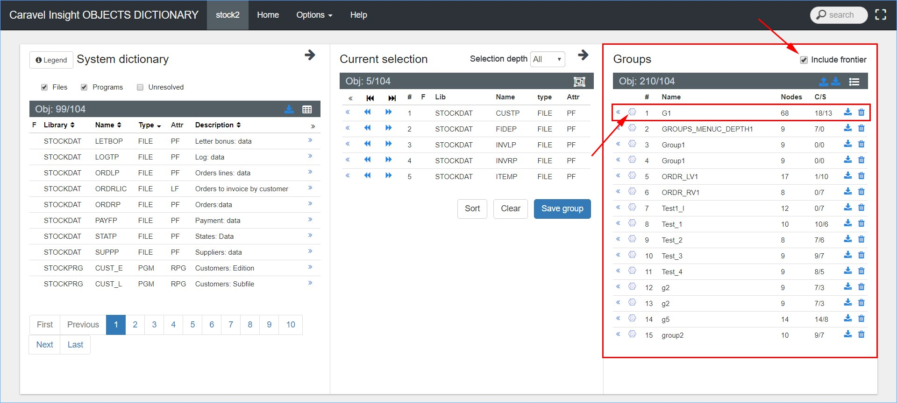

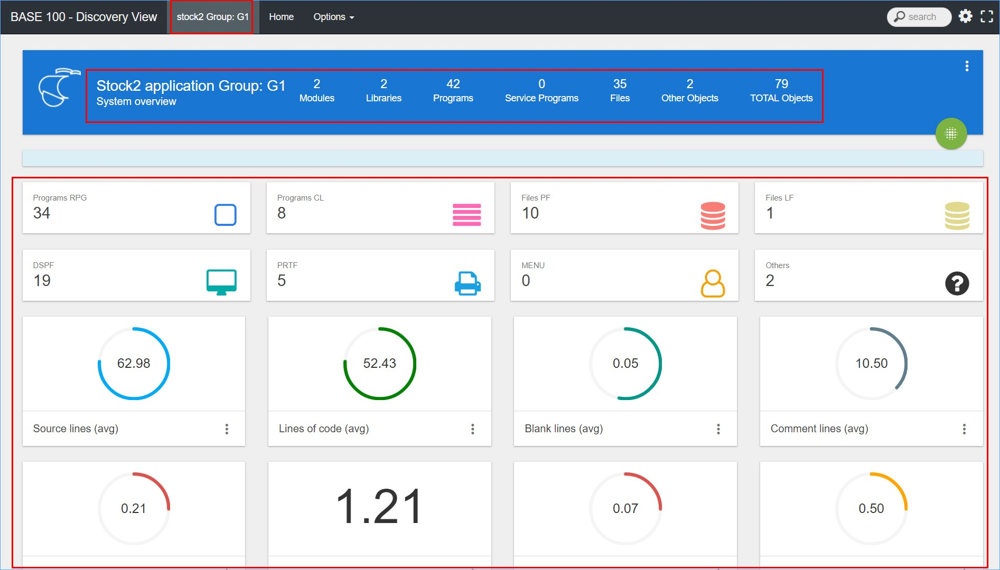

Se puede observar que la página inicial del Subsistema (Grupo) se asemeja visualmente a la del Sistema principal, con la diferencia que los cálculos y elementos mostrados en el mismo son pertenecientes a este. La navegación entre las páginas y las opciones disponibles en los menús son iguales a la del Sistema principal.

Antes de crear el Subsistema se podrá seleccionar la casilla de verificación "**Include frontier**" que tiene como funcionalidad enviar también los elementos que hacen referencia o son elementos referenciados por elementos del Grupo, a estos se les denomina Fronteras y son necesariamente útil para hacer un análisis completo ya que estos elementos pueden generar una inconsistencia en el Sistema si se desea retirar el Grupo.

### Editar Grupo

Los Grupos del Sistema podrán ser modificados o eliminados del mismo. Para eliminar un Grupo se debe pulsar el icono  situado a la derecha del nombre del mismo, es importante decir que no hay un mensaje previo por lo tanto la eliminación es directa.

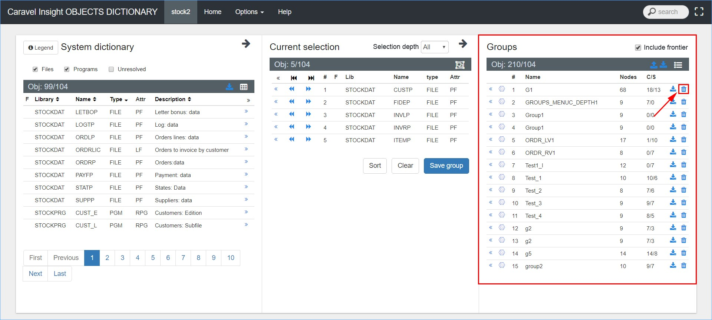

Para editar un Grupo se debe pulsar el icono  situado en la parte izquierda de la descripción del mismo. Al pulsar este botón los elementos serán enviados a la sección "**Current selection**", en esta sección será posible agregar o retirar elementos, modificar los datos descriptivos del Grupo. Una vez que los elementos sean enviados a la sección "**Current selection**" el proceso de modificación es igual que el proceso para crear un Grupo.

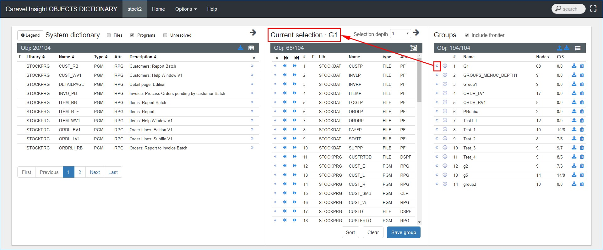
