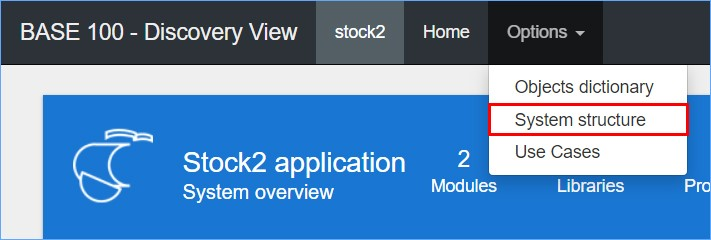

La página "**System structure**" es el punto de inicio del análisis del Sistema. Esta página ofrece una visión gráfica de todos los elementos presentes en el Sistema (ficheros, programas, variables) y sus relaciones (to y from). Una imagen completa y fácil de entender de todo el Sistema. Desde aquí se podrá bajar a cualquier detalle.

Esta página también muestra la estructura en detalle de cada elemento, así como la información completa del mismo. Dependiendo del tipo de elemento se puede navegar entre las diferentes opciones que se presentan. También en el caso de los elementos de tipo ficheros, se podrá descargar toda la información contenida en cada archivo, es decir los registros que componen dicho elemento.

Los Grupos y Subgrupos se pueden definir a diferentes niveles de profundidad, lo que permite identificar los componentes funcionales en la estructura de datos.

Los Subsistemas se pueden identificar, extraer y analizar por separado, para enfocar sus diversas características y seguir flujos de datos específicos. Cualquiera de ellos puede identificarse y etiquetarse por separado, incluidos todos los metadatos apropiados (propietario, responsable, tipo, nivel de protección, etc.).

Para acceder a esta página se debe selecciona la opción "**System structure**" de la droplist "**Options**" del "**Menú principal**". A continuación, se muestra su apariencia:

La página "**System structure**" está compuesta por tres secciones donde se podrán ejecutar y visualizar los resultados de las diferentes funcionalidades. A continuación, se muestran:

*   **Panel de visualización**. Es el área central de esta sección donde se muestra todo el resultado tras la ejecución de las diversas funcionalidades que ofrece esta página. También se podrán observar datos informativos referente al elemento o a la selección de elementos que serán explicadas más adelante.
*   **Menú vertical izquierdo**. Este menú contiene accesos directos del "**Menú principal**" y está orientado también a la configuración de la gráfica, es decir, se podrá seleccionar desde este menú la relación en que se relaciona un elemento con el resto, también se podrá cambiar la forma en que se presenta la gráfica, entre otras cosas que serán explicadas más adelante.
*   **Menú principal**. Este menú mantiene todas las características y funciones del "**Menú principal**" de la página de inicio, con la diferencia que se han agregado nuevas droplist y menús, que contienen las opciones de análisis. Todas serán explicadas más adelante.

A continuación, se explicarán cada una de las secciones anteriormente nombradas.

## Panel de Visualización

El "**Panel de Visualización**" es la sección donde se muestran los resultados de la ejecución de las diversas opciones, en esta sección se podrá observar en la parte superior una "**Barra de estado**" que muestra información acerca el elemento o la selección de elementos. Igualmente dispone de una sub sección oculta llamada "**Panel de selección**" que se despliega al pulsar el icono situado en la parte derecha de la "**Barra de estado**".

Cuando se procede a seleccionar uno o varios elementos, la "**Barra de estado**" muestra información que hace referencia a la selección efectuada. Se dispone también de dos botones que permiten navegar en la estructura del elemento seleccionado, mostrando su código fuente y su información general, entre otras cosas. A continuación, se explicará la "**Barra de estado**".

### Barra de estado

A continuación, se explica en detalle la información que se muestra en la "**Barra de estado**":

Al pulsar este botón se muestra una página emergente con la leyenda de todos los iconos que se muestran en la página de "**System structure**". Es importante decir que este botón estará disponible en cualquier momento en la "**Barra de estado**" por lo cual no será necesario seleccionar elementos. A continuación, se muestran los iconos correspondientes a esta página:

El botón "**Info**" muestra la información general del elemento seleccionado, a continuación, se muestra un ejemplo:

Se puede observar una que presenta la siguiente información:

*   **Edges Out/In**. Se refiere a la cantidad de entradas y salidas que tiene el elemento, es decir las relaciones con el resto del Sistema. "**In**" indica la cantidad de elementos que son referenciados por el elemento seleccionado (**From**) y "**Out**" indica la cantidad de elementos que hacen referencia al elemento seleccionado (**To**).
*   **Description**. Muestra el texto descriptivo del funcionamiento del elemento.
*   **Type**. Calificativo al que pertenece el elemento.
*   **Attr**. Se muestra un calificativo según el tipo y lenguaje que está elaborado el elemento.
*   **Size (bytes)**. Mide en bytes la cantidad de espacio que ocupa en memoria el elemento.
*   **Creation date**. Muestra la fecha y hora exacta que se creó el elemento.
*   **Creation System**. Muestra el nombre del servidor AS400 donde se creó el elemento.
*   **Creator**. Muestra el nombre del usuario que creó el elemento.
*   **Sources lines**. Total, de líneas de código que se utilizaron para crear el elemento.
*   **Complexity**. Complejidad ciclomática del elemento.

Al pulsar este botón se abre una pestaña en el navegador donde se podrá visualizar toda la estructura del elemento. Se muestra un ejemplo:

Mediante el botón  que se dispone en la parte derecha al final de cada pestaña, se despliega la información contenida en cada una. La primera pestaña muestra la información general del elemento junto a las métricas correspondientes, se muestra un ejemplo:

En la pestaña "**Source code**" se detalla todo el código fuente del elemento, mientras que las pestañas siguientes son variables ya que se muestra desglosado por partes el "**Source code**". A continuación, se muestra un ejemplo:

Las pestañas siguientes como se mencionaba antes son fragmentos del "**Source code**" donde se podrá ver de tres maneras que se muestran a continuación:

El **_Visor Discovery_** hace una traducción del código "**Legacy**" a "**Pseudocódigo Java**" y "**Diagrama de flujo**" con la intención de mejorar la interpretación del elemento de cara a un proceso de conversión. Esto se podrá hacer con cualquier elemento presente en el Sistema.

Esta parte de la "**Barra de estado**" muestra el nombre (INVO_PB) junto al identificador del elemento (26).

Se muestran las relaciones que tiene el elemento con el resto de elementos del Sistema. "**Out**" Indica la cantidad de elementos que hacen referencia al elemento seleccionado, se conocen también como "**Dependencias**" y "**In**" Indica la cantidad de elementos que son referenciados por el elemento seleccionado también se conocen como "**Precedencias**".

En esta parte se muestra la cantidad de líneas de código que se han utilizado para crear el elemento, seguido de la complejidad ciclomática del mismo.

Hace referencia a la cantidad de líneas de código que se han utilizado para crear los elementos y la complejidad promedio de toda la selección de elementos.

El número "**10**" hace referencia a la cantidad de elementos seleccionados, el siguiente número "**104**" hace referencia a la cantidad de elementos mostrados en el "**Panel de visualización**", posteriormente se muestra el número "**104**" que hace referencia a la cantidad total de elementos que conforman en el Sistema y por último se muestra el número "**12**" encerrado entre corchetes "**[]**" que hace referencia a la cantidad de Clusters creados en el Sistema.

Un Clusters es mayormente utilizado en los Sistemas de una cierta dimensión, ya que el elevado número de objetos dificulta su uso. Se define como una agrupación de elementos con el único objetivo de reducir el número de elementos visualizados, facilitar la visualización y manipulación del Sistema.

Al pulsar sobre este botón situado en la parte derecha de la "**Barra de herramientas**" se despliega un panel llamado "**Panel de Selección**" donde se verán los Grupos, Etiquetas, Casos de Uso, entre otras cosas que se explicarán más adelante. Por otra parte, este botón estará disponible en cualquier momento.

### Panel de Selección

Es un panel que como se mencionaba permanece oculto, pulsando el botón  situado en la parte derecha de la "**Barra de estado**" se muestra teniendo la siguiente apariencia:

Este panel, contiene cuatro secciones denominadas "**Current selection** ", "**Groups** ", "**Tags** " y "**Use Cases** ". Estas secciones serán explicadas a continuación.

#### Current selection

Esta sección es similar a la antes explicada de la página "**Objects dictionary**", con la diferencia que incluye nuevas funcionalidades. Una de estas es la usabilidad de "Fronteras", la creación de Clusters, entre otras.

Se explicará en detalle cada una de las funciones que se podrán ejecutar en esta sección.

##### Seleccionar elementos

Para enviar elementos a esta sección, se debe seleccionar manteniendo el botón derecho del ratón y pasando sobre el o los elementos deseados, después una vez seleccionado los elementos se debe pulsar el icono . A continuación, se muestra un ejemplo:

Si se quisiera retirar un elemento de la lista, se tiene que pulsar el icono  situado en la parte derecha de la descripción del mismo. Por otra parte, si se quiere retirar todos los elementos se debe pulsar el botón .

##### Crear Grupos o Clusters

Una vez que se hayan seleccionado los elementos se puede crear una agrupación donde podría ser en este caso Grupo o Cluster. Para ello se debe de pulsar el icono  apareciendo una página emergente que permite introducir los datos descriptivos de la misma. A continuación, se muestra un ejemplo:

Como se puede observar en la parte inferior de la página emergente se disponen dos botones que permiten la creación de la agrupación, para crear un Grupo se debe pulsar sobre el botón "**Save as Group**" y para crear un Cluster se debe pulsar el botón "**Save as Cluster**".

##### Download

Al pulsar sobre este botón se descarga un archivo Excel con información de los elementos seleccionados en la sección. Este archivo Excel es igual al explicado en la página "**Objects dictionary**", para más información véase en ese apartado.

#### Groups

En esta sección se muestra un listado con todas las agrupaciones del Sistema, es decir Grupos y Clusters. Mediante las diferentes funciones se podrán editar, descargar y comparar. Se explicará a continuación.

##### Editar

Se podrá eliminar un Grupo o Cluster pulsado el icono  situado en la parte derecha de la descripción de cada uno, es importante decir que la acción será directa. Por otra parte, la modificación de una agrupación se podrá hacer pulsando el icono  que cumple con la función de trasladar todos los elementos correspondientes a la agrupación a la sección "**Current selection**" donde se podrán agregar o retirar elementos, de igual forma se podrán cambiar los datos descriptivos de la misma.

##### Download y Upload

Igual que en la página "**Objects dictionary**" se podrá descargar un archivo Excel con información de una o todas las agrupaciones, para ello se emplea el botón . Igualmente, una vez se hay editado dicho archivo se podrá cargar al Sistema mediante el botón , para más información véase en la página "**Objects dictionary**" donde habla más en detalle sobre el proceso de subida y las modificaciones que se pueden efectuar.

##### Botones Select, Or y And

Estos botones se encuentran en la parte superior de esta sección, cada uno cumple con una función específica que se explican a continuación:

###### Select

Por omisión este botón se encuentra activado y cumple con la función de mostrar los elementos de un Grupo específico en el "**Panel de visualización**". Si los elementos del Grupo se encuentran junto a otros elementos no pertenecientes al Grupo, se mostrarán resaltados según el color definido únicamente aquellos elementos correspondientes al Grupo mientras que el resto se muestran en segundo plano. A continuación, se muestra un ejemplo:

###### Or

A diferencia del botón "**Select**" al seleccionar este botón permite escoger más de una agrupación, dejando resaltado los elementos de las agrupaciones según el color definido. A continuación, se muestra un ejemplo:

###### And

Por último, este botón cumple con la función de resaltar únicamente los elementes que tienen en común la selección de Grupos, cuando no existen elementos en común todos los elementos se muestran en segundo plano. A continuación, se muestra un ejemplo:

#### Tags

Las etiquetas son marcas que se ponen a un elemento con el fin de diferenciar las diferentes acciones del mismo, un elemento puede estar asociado a varias etiquetas. El etiquetado no afecta en el funcionamiento del Sistema ya que como se mencionaba antes es una marca distintiva.

El proceso para crear una etiqueta se efectúa desde la página emergente "**Save selection**" de la creación de Grupos, donde hay un campo que permite poner una etiqueta. Si la etiqueta ya existe será actualizada asociando los nuevos elementos, mientras que si no existe será creada al momento. En esta sección se podrá ver la lista de etiquetas creadas en el Sistema, igualmente se podrán realizar funciones que serán explicadas a continuación.

##### Download

Se podrá descargar mediante la funcionalidad del botón  que una vez pulsado automáticamente descarga un archivo en formato Excel que contiene información de las etiquetas creadas en el Sistema. Igual que en la sección "**Groups**" se podrá descargar la información de una etiqueta en específico para ello se debe pulsar el botón  que se ubica en la parte derecha de la descripción de la misma. A continuación, se muestra un ejemplo:

Como se puede observar al descargar la información de todas las etiquetas, se muestra en el documento diferentes pestañas con el nombre de cada una que contiene la información de los elementos que están asociados a la misma. Los encabezados de esta tabla hacen referencia a lo siguiente:

*   **Oid**. Es el código utilizado para identificar el elemento en el Sistema, no habrá dos elementos con el mismo código.
*   **Library**. Muestra el nombre de la librería al que pertenece el elemento.
*   **Name**. Se refiere al nombre del elemento.
*   **Title**. Es un texto descriptivo que hace referencia a la funcionalidad del elemento.
*   **Type**. Calificativo del elemento (fichero o programa).
*   **Attr**. Según el tipo y lenguaje de programación, se asigna un atributo.

##### Statistics

Las estadísticas de una etiqueta, se basa en la cantidad de veces que se han ejecutado los comando que contienen los elementos en el Sistema. La descarga se hará de forma individual por etiqueta pulsando el botón  que se ubica en la parte derecha de la descripción de la misma. A continuación, se muestra un ejemplo:

Los encabezados hacen referencia a:

*   **Name**. Nombre del comando o instrucciones en los elementos.
*   **Percentage**. Promedio de la frecuencia en la invocación del comando.
*   **Times**. Número de veces que ha sido invocado el comando.

Como se puede observar en las estadísticas se muestran nombres de comandos y no los nombres de los elementos, esto es debido a que se analizan las instrucciones contenidas en el código obteniendo de esta manera los nombres de comandos y las veces que se han utilizado. Se puede observar el promedio de utilización que tiene cada comando que al sumar es un 100%, también se observa las veces que ha sido invocado cada comando teniendo un mayor promedio el comando con más veces invocado.

##### Botones Select, Or y And

La funcionalidad de estos botones es igual a la funcionalidad de los botones "**Select**", "**Or**" y "**And**" de la sección "**Groups**".

El botón "**Select**" esta activado por omisión y cumple con la función de mostrar los elementos que pertenecen a una etiqueta selecciona al "**Panel de visualización**". El botón "**Or**" cumple con la función de enviar al "**Panel de visualización**" los elementos de una o más etiquetas. Por último, el botón "**And**" cumple con la función de comparar dos o más etiquetas y enviar al "**Panel de visualización**" únicamente los elementos en común que tienen las etiquetas seleccionadas. Los ejemplos de la funcionalidad de estas funciones se podrán visualizar en la sección "**Groups**".

##### Eliminar etiqueta

Para eliminar una etiqueta se debe pulsar el botón  ubicado en la parte derecha de la descripción de la misma. Es importante decir que no habrá un mensaje de confirmación y la etiqueta será eliminada tras haber pulsado dicho botón.

#### Use Cases

Un "**Caso de Uso**" se define como la secuencia de interacciones que van dirigidas a cumplir una acción especifica. Es muy común encapsular procesos que son utilizados con frecuencia en la relación Sistema / hombre. En esta sección se podrán observar y analizar los procesos que forman un "**Caso de uso**", es importante decir que todos los "**Casos de uso**" son elaborados por la herramienta "_**Caravel Test Maker**_". Dentro de esta sección se podrán ejecutar diferentes funciones que se explican a continuación.

##### Download

Utilizando el botón  que se encuentra en la parte superior de esta sección, se descargará un archivo en formato Json que contiene información de los "**Casos de uso**" del Sistema. A continuación, se muestra un ejemplo:

Se puede observar que cada "**Caso de uso**" presenta la siguiente información:

*   **Name**. Nombre del **Caso de uso**.
*   **Description**. Texto descriptivo de la funcionalidad u orientación del mismo.
*   **ObjectsIds**. Se muestran por medio del **OID** los elementos que se incluyen en cada **Caso de uso**.

## Menú vertical izquierdo

Este menú como su nombre lo indica, se encuentra ubicado en la parte izquierda de la página "**System structure**" y está compuesto por accesos directos del "**Menú principal**" y diversas funciones que controlan la forma en que se muestran los elementos en el "**Panel de visualización**". A continuación, se muestra su apariencia:

Cada componente de esta sección será explicada a continuación.

### Select

Es una droplist que contiene opciones orientadas a la filtración de elementos. Se podrá filtrar un elemento por su característica o funcionamiento en el Sistema. A continuación, se muestran las opciones disponibles:

Se explicará en detalle cada una de las opciones que se muestran en esta droplist:

<table class="tablem" cellspacing="8" cellpadding="8">

<thead>

<tr>

<td width="186" valign="top">

Tipo de filtro

</td>

<td width="774" valign="top">

Descripción

</td>

<td width="186" valign="top">

Referencia

</td>

</tr>

</thead>

<tbody>

<tr>

<td width="143" valign="top">

**All**

</td>

<td width="257" valign="top">

El funcionamiento de esta opción es seleccionar todos los elementos que se muestran en el "**Panel de visualización**". Se puede activar desde el "**Menú vertical izquierdo**" o desde la droplist "**Select / All nodes**" del "**Menú principal**", se podrá activar también con el acelerador de teclado [**Alt** + **A**]. A continuación, un ejemplo:

</td>

<td width="166" valign="top">

[Ver imagen](img/052.jpg)

</td>

</tr>

<tr>

<td width="143" valign="top">

**Start nodes**

</td>

<td width="257" valign="top">

El funcionamiento de esta opción es marcar los elementos donde se inicia el Sistema, es decir donde el Sistema tiene la primera entrada de datos. Los "**Start nodes**" se identifican por ser elementos (o componentes) que llaman a otros elementos, pero que no son llamados por ninguno. Presumiblemente son programas que deben ser activados manualmente y por lo tanto puntos de entrada al Sistema.

Se puede activar desde el "**Menú vertical izquierdo**" o desde la droplist "**Select / Start nodes**" del "**Menú principal**", el acelerador de teclado para esta opción es [**Alt** + **S**]. A continuación, un ejemplo:

</td>

<td width="166" valign="top">

[Ver imagen](img/053.jpg)

</td>

</tr>

<tr>

<td width="143" valign="top">

**End nodes**

</td>

<td width="257" valign="top">

El funcionamiento de esta opción es marcar los elementos donde se termina el Sistema, es decir donde el Sistema tiene la finalización del flujo de datos. Generalmente los "**End nodes**" se identifican por ser elementos (o componentes) que son llamados por otros elementos, pero que no llaman a ninguno. Presumiblemente son elementos de tipo "**Ficheros**" más comúnmente "**Display file**" o en algunos casos de tipo "**Programas**" que escriben un log o reporte.

Se puede activar desde el "**Menú vertical izquierdo**" o desde la droplist "**Select / End nodes**" del "**Menú principal**", se podrá activar también con el acelerador de teclado [**Alt** + **E**]. A continuación, un ejemplo:

</td>

<td width="166" valign="top">

[Ver imagen](img/054.jpg)

</td>

</tr>

<tr>

<td width="143" valign="top">

**Orphan nodes**

</td>

<td width="257" valign="top">

El funcionamiento de esta opción es marcar los elementos que no son utilizados en el Sistema. Se les denomina "**Orphan nodes**" por carecer de "**dependencias**" y "**precedencias**" y generalmente están aislado al resto de elementos del Sistema.

Se puede activar desde el "**Menú vertical izquierdo**" o desde la droplist "**Select / Orphan nodes**" del "**Menú principal**", se podrá activar también con el acelerador de teclado [**Alt** + **O**]. A continuación, un ejemplo:

</td>

<td width="166" valign="top">

[Ver imagen](img/055.jpg)

</td>

</tr>

<tr>

<td width="143" valign="top">

**Reused nodes**

</td>

<td width="257" valign="top">

El funcionamiento de esta opción es marcar los elementos que son reusados con frecuencia en el Sistema. Se les denomina "**Reused nodes**" por tener un alto número de referencias, cabe destacar que existe una funcionalidad que permite definir un número mínimo de referencia para considerar un elemento como "**Reused nodes**".

Un caso típico de elementos reutilizados son las subrutinas de bajo nivel que realizan operaciones básicas y que son invocadas por un gran número de programas del Sistema. Otro caso frecuente lo constituyen aquellos ficheros que, por contener información básica, son leídos por un elevado número de programas.

Se puede activar desde el "**Menú vertical izquierdo**" o desde la droplist "**Select / Orphan nodes**" del "**Menú principal**", también el acelerador de teclado [**Alt** + **R**]. A continuación, un ejemplo:

</td>

<td width="166" valign="top">

[Ver imagen](img/056.jpg)

</td>

</tr>

</tbody>

</table>

### Hide

Es una droplist que mediante sus opciones será posible hacer simulaciones pudiendo ocultar diferentes elementos y analizar el resultado y la reacción del Sistema. Cabe mencionar que estas opciones estarán disponibles también en la droplist "**Hide**" del "**Menú principal**". A continuación, se explican las opciones presentes en esta droplist:

A continuación, se explica en detalle cada una de las opciones presentes en este menú.

<table class="tablem" cellspacing="8" cellpadding="8">

<thead>

<tr>

<td width="186" valign="top">

Opción

</td>

<td width="774" valign="top">

Descripción

</td>

<td width="186" valign="top">

Referencia

</td>

</tr>

</thead>

<tbody>

<tr>

<td width="143" valign="top">

**Selected node**

</td>

<td width="257" valign="top">

El funcionamiento de esta opción es ocultar un elemento seleccionado desde el "**Panel de visualización**". Para ocultar un elemento, habrá que seleccionarlo pulsando sobre él y posteriormente activar la opción "**Selected node**". Es importante decir que todas las opciones de este menú son simulaciones y no eliminan los elementos del Sistema.

</td>

<td width="166" valign="top">

[Ver imagen](img/058.jpg)

</td>

</tr>

<tr>

<td width="143" valign="top">

**Selection**

</td>

<td width="257" valign="top">

A diferencia de la primera opción "**Selected node**", el funcionamiento de esta opción permite ocultar una selección completa de elementos. Como ejemplo se hará una selección marcando elementos con el botón derecho del ratón y trazando un rectángulo cubriendo los elementos que se quieren ocultar.

</td>

<td width="166" valign="top">

[Ver imagen](img/059.jpg)

</td>

</tr>

<tr>

<td width="143" valign="top">

**Unselected**

</td>

<td width="257" valign="top">

La funcionalidad de esta opción es ocultar los elementos que están fuera de una selección, es decir que al seleccionar varios elementos y activar esta opción se ocultarán los elementos no seleccionados. A continuación, se muestra un ejemplo:

</td>

<td width="166" valign="top">

[Ver imagen](img/060.jpg)

</td>

</tr>

<tr>

<td width="143" valign="top">

**Undo hide**

</td>

<td width="257" valign="top">

El funcionamiento de esta opción, es mostrar nuevamente en el "**Panel de visualización**" los elementos que han sido ocultados con las opciones anteriores. A continuación, se muestra un ejemplo:

</td>

<td width="166" valign="top">

[Ver imagen](img/062.jpg)

</td>

</tr>

</tbody>

</table>

### File

Es un switch que permite activar o desactivar la visualización de los elementos de tipo "fichero" en el "**Panel de visualización**". A continuación, se muestra un ejemplo de este switch activado:

### Programs

Es un switch que permite activar o desactivar la visualización de los elementos de tipo "programa" en el "**Panel de visualización**". A continuación, se muestra un ejemplo de este switch activado:

Es importante decir que los elementos que se muestran en el "**Panel de visualización**" van en dependencia de las características del Sistema.

### Unresolved

Los elementos "**Unresolved**" se caracterizan por ser componentes ("ficheros" y "programas") que no pertenecen al Sistema, pero que a su vez son llamados por elementos dentro del mismo, dando lugar a una potencial inconsistencia.

No todos los Sistemas cuentan con este tipo de elementos. A continuación, se muestra un ejemplo:

### Frontiers

La opción "**Frontiers**" ayuda a comprender la relación entre un Subsistema (Grupo de elementos) de un Sistema y el resto de elementos del mismo.

Este mecanismo permite acotar qué elementos de un Grupo seleccionado, en el caso de ser eliminado, generarían conflicto, dado que son referenciados por otros componentes del Sistema. Recíprocamente, algunos de estos elementos pueden requerir a su vez de otros elementos del Sistema, cuya eliminación generaría así mismo conflicto.

La opción "**Frontiers**" también proporciona información en relación a qué elementos de un Grupo seleccionado pueden eliminarse del Sistema sin causar conflicto, por carecer de referencias a otros componentes externos al mismo, y no ser a su vez, referenciados por ningún otro componente.

A continuación, se muestra un ejemplo de la utilización y aplicación de la opción "**Frontiers**", tomando como punto de partida la selección de elementos en el "**Panel de selección**".

Es importante decir que, para el correcto funcionamiento de esta opción, los elementos deben de estar seleccionado en la sección "**Current selection**" del "**Panel de selección**".

#### Tipos de elementos "Frontiers"

Existen diferentes tipos de "Fronteras".

En primer lugar, los elementos que permanecen dentro de un Subsistema y se relacionan con elementos fuera del mismo se denominan "**Internos**" y se representan en color verde.

En segundo lugar, los elementos que se sitúan fuera del Subsistema y tienen relación con otros dentro de éste se denominan "**Externos**" y se representan en color rojo.

Los elementos representados en color azul, son objetos que permanecen dentro del Subsistema y no se relacionan con otros elementos externos al Subsistema. Es decir, que al ser retirados no generarían conflictos.

Por otro lado, un elemento que llama a otro se denomina cliente ("**Client**"), mientras que un elemento que es llamado se denomina servidor ("**Service**").

A su vez, estos elementos pueden ser programas o ficheros.

A continuación, se indica el significado de cada elemento en relación a la diferente tipología de "Fronteras" disponibles:

<table class="tablem" cellspacing="8" cellpadding="8">

<thead>

<tr>

<td width="100" valign="top">

Iconos

</td>

<td width="186" valign="top">

Descripción

</td>

<td width="774" valign="top">

Referencia

</td>

</tr>

</thead>

<tbody>

<tr>

<td width="143" valign="top">

</td>

<td width="257" valign="top">

**Internal Service Program**

</td>

<td width="166" valign="top">

Programa que pertenece al Subsistema y es llamado desde un objeto externo.

</td>

</tr>

<tr>

<td width="143" valign="top">

</td>

<td width="257" valign="top">

**Internal Service File**

</td>

<td width="166" valign="top">

Fichero que pertenece al Subsistema y es llamado desde un objeto externo.

</td>

</tr>

<tr>

<td width="143" valign="top">

</td>

<td width="257" valign="top">

**Internal Client Program**

</td>

<td width="166" valign="top">

Programa que pertenece al Subsistema y llama a un objeto externo.

</td>

</tr>

<tr>

<td width="143" valign="top">

</td>

<td width="257" valign="top">

**Internal Client File**

</td>

<td width="166" valign="top">

Fichero que pertenece al Subsistema y llama a un objeto externo.

</td>

</tr>

<tr>

<td width="143" valign="top">

</td>

<td width="257" valign="top">

**Intenal Client/Service Program**

</td>

<td width="166" valign="top">

Programa que pertenece al Subsistema, es llamado desde un objeto externo y llama a su vez a un objeto externo.

</td>

</tr>

<tr>

<td width="143" valign="top">

</td>

<td width="257" valign="top">

**Intenal Client/Service File**

</td>

<td width="166" valign="top">

Fichero que pertenece al Subsistema, es llamado desde un objeto externo y llama a su vez a un objeto externo.

</td>

</tr>

<tr>

<td width="143" valign="top">

</td>

<td width="257" valign="top">

**External Service Program**

</td>

<td width="166" valign="top">

Programa que no pertenece al Subsistema y es llamado por un objeto interno.

</td>

</tr>

<tr>

<td width="143" valign="top">

</td>

<td width="257" valign="top">

**External Service File**

</td>

<td width="166" valign="top">

Fichero que no pertenece al Subsistema y es llamado por un objeto interno.

</td>

</tr>

<tr>

<td width="143" valign="top">

</td>

<td width="257" valign="top">

**External Client Program**

</td>

<td width="166" valign="top">

Programa que no pertenece al Subsistema y llama a un objeto interno.

</td>

</tr>

<tr>

<td width="143" valign="top">

</td>

<td width="257" valign="top">

**External Client File**

</td>

<td width="166" valign="top">

Fichero que no pertenece al Subsistema y llama a un objeto interno.

</td>

</tr>

<tr>

<td width="143" valign="top">

</td>

<td width="257" valign="top">

**External Client/Service Program**

</td>

<td width="166" valign="top">

Programa que no pertenece al Subsistema, es llamado desde un objeto interno y llama a su vez a un objeto interno.

</td>

</tr>

<tr>

<td width="143" valign="top">

</td>

<td width="257" valign="top">

**External Client/Service File**

</td>

<td width="166" valign="top">

Fichero que no pertenece al Subsistema, es llamado desde un objeto interno y llama a su vez a un objeto interno.

</td>

</tr>

</tbody>

</table>

### Stabilizing

La funcionalidad de este switch es activar o desactivar los efectos gravitacionales que hacen que la gráfica en el "**Panel de visualización**" se muestre de manera ordenada. No obstante, a veces resulta necesario desactivar dichos efectos para fijar los elementos en un solo sitio. A continuación, se muestra un ejemplo.

### Refresh

Tras haber ejecutado una serie de funciones, los elementos pueden mostrarse desordenados complicando el análisis de los mismos. El funcionamiento de este botón es reiniciar la gráfica mostrada en el "**Panel de visualización**" devolviendo al estado inicial.

### Selection Depth y Edge direction

Mediante estas listas de selección se podrá definir el nivel de profundidad y la dirección que se relacionará el elemento seleccionado con el resto del Sistema, es decir permite escoger ver las dependencias o precedencias de un elemento a diferentes escalas. A continuación, se explicará cada una.

#### Selection Depth

Se podrá elegir el nivel de profundidad que tendrá un elemento con el resto del Sistema, como se mencionaba esta función va en dependencia de la dirección definida. Los niveles que se podrán elegir son:

*   **0**. Este nivel muestra solo el elemento seleccionado.
*   **1**. En este nivel se muestra el elemento seleccionado más su relación.
*   **2**. Se muestra el elemento seleccionado más las relaciones de los elementos del nivel "**1**".
*   **3**. Se muestran las relaciones del elemento seleccionado más las relaciones de los elementos del nivel "**2**".
*   **All**. Se muestran las relaciones en todos los niveles de todos los elementos seleccionados.

#### Edge Direction

Se podrá definir la dirección en la que se relacionará un elemento que vaya ser seleccionado con los elementos del Sistema, es decir se podrá elegir entre ver las dependencias o precedencias del elemento. A continuación, se muestran las opciones disponibles.

*   **To**. Al seleccionar esta opción se visualizan los elementos que hacen referencia al elemento seleccionado, es decir "**Dependencias**". También se conocen en la herramienta como salidas "**Out**".
*   **From**. Al seleccionar esta opción se visualizan los elementos que son referenciados por el elemento seleccionado, es decir "**Precedencias**". También se conocen en la herramienta como entradas "**In**".
*   **Both**. Se visualizarán las "**Dependencias**" y "**Precedencias**" del elemento.

A continuación, se muestra un ejemplo utilizando diferentes configuraciones:

### Compress / Expand

La funcionalidad de este botón, es alternar la configuración en que se muestran los elementos de la gráfica. El modo "**Compress**" se refiere a una vista donde los elementos se presentan más unidos, en cambio el modo "**Expand**" se refiere a una vista donde los elementos se presentan más separados permitiendo una mejor visualización en detalle.

### Hierarchical / Network

Al pulsar sobre este botón se podrá cambiar la forma gráfica mostrada en el "**Panel de visualización**" teniendo dos diferentes modos.

"**Network**" este modo se muestra por omisión al entrar a la página "**System structure**" y simula gráficamente una red formada a partir de las relaciones que tienen los elementos entre ellos.

"**Hierarchical**" es un modo jerárquico que se forma a partir la importancia de un elemento en el Sistema, se mostrarán en la parte superior aquellos elementos con más importancia y en los siguientes niveles aquellos elementos con menor relevancia en el mismo.

A continuación, se muestra un ejemplo con ambos modos.

## Menú principal

El "**Menú principal**" de la página "**System structure**" agrega nuevas opciones en comparación al "**Menú principal**" de la "**Página de inicio**", entre ellas están:

*   **View**. Es una droplist que contiene opciones orientadas a diferentes tipos de vistas como, por ejemplo: los tamaños relativos de cada elemento, aumentar en un nivel la selección de elementos, entre otras cosas.
*   **Select**. Esta droplist contiene opciones de filtración en dependencia de las características de los elementos, es decir se podrán filtrar los elementos donde se tiene el primer acceso de datos, entre otras cosas.
*   **Hide**. Es una droplist que contiene opciones que permiten ocultar diferentes elementos del Sistema.
*   **Add hidden nodes**. Es una casilla de verificación que permite mostrar en el "**Panel de visualización**" elementos que están ocultos. Un ejemplo común de la utilización de esta casilla es cuando se accede a la página "**System structure**" con una red vacía y se desea visualizar un Grupo, si esta casilla no está marcada será imposible ejecutar dicha acción.
*   **Search**. Es un cuadro de búsqueda que devuelve como resultado los elementos que coincidan con los criterios especificados en dicho campo. Algunos de estos criterios pueden ser: atributo del elemento, nombre del elemento, identificador del elemento (**Oid**), nombre de la librería, etc.
*   **Configuration**. En el menú se representa por el icono  y es una página emergente que permitirá hacer diversas configuraciones, como definir los parámetros para considerar un elemento rehusado, entre otras cosas.
*   **Network Configuration**. Representado por el icono  se muestra una página emergente que permite modificar los efectos gravitatorios, velocidad y aspectos de configuración en la gráfica del "**Panel de visualización**".
*   **Full screen**. Mediante este botón representado por el icono  se podrá acceder al modo pantalla completa, para salir de este modo se tendrá que pulsar la tecla [**Esc**] del teclado.

Todos los componentes de este menú serán explicados en detalles en los siguientes apartados.

### View

Esta droplist contiene opciones que cumplen la función de mostrar diferentes tipos de vista en los elementos que se presenta en el "**Panel de visualización**".

A continuación, se explicarán las opciones de este menú.

<table class="tablem" cellspacing="8" cellpadding="8">

<thead>

<tr>

<td width="186" valign="top">

Opción

</td>

<td width="774" valign="top">

Descripción

</td>

<td width="186" valign="top">

Referencia

</td>

</tr>

</thead>

<tbody>

<tr>

<td width="143" valign="top">

**Propagate selection**

</td>

<td width="257" valign="top">

Según la dirección orientada ("to" o "from") esta opción permite incrementar en un nivel la relación del o de los elementos seleccionados. Los términos "to" (se refiere a elementos que son llamados por el elemento seleccionado "precedencias") y "from" (se refiere a los elementos que llaman al elemento seleccionado "dependencias") son términos que se utilizarán a lo largo de este manual y son explicados en "**Selection depth y Edge direction**". Esta opción se activa desde el menú tipo droplist "**View**" opción "**Propagate selection**".

</td>

<td width="166" valign="top">

[Elemento seleccionado](img/071.jpg)

[Función activada](img/072.jpg)

</td>

</tr>

<tr>

<td width="143" valign="top">

**Propagate selection (reveal hidden nodes)**

</td>

<td width="257" valign="top">

El funcionamiento de esta opción es similar a la opción anterior con la diferencia que al utilizar esta opción será posible traer elementos ocultos, es decir se podrán las "**Dependencias**" o "**Precedencias**" de un elemento incluso si no se encuentra en el "**Panel de visualización**". A continuación, se muestra un ejemplo:

</td>

<td width="166" valign="top">

[Elemento seleccionado](img/073.jpg)

[Función activada](img/074.jpg)

</td>

</tr>

<tr>

<td width="143" valign="top">

**Invert selection**

</td>

<td width="257" valign="top">

Por lo general cuando se hace una selección de elementos, estos quedan resaltados en el "**Panel de visualización**" dejando en segundo plano aquellos elementos que están fuera de dicha selección. La funcionalidad de esta opción es invertir este comportamiento dejando en segundo plano los elementos seleccionados. A continuación, se muestra un ejemplo:

</td>

<td width="166" valign="top">

[Elementos seleccionados](img/075.jpg)

[Función activada](img/076.jpg)

</td>

</tr>

<tr>

<td width="143" valign="top">

**Use Selection as frontier**

</td>

<td width="257" valign="top">

La funcionalidad de esta opción es definir la ruta recorrida en la propagación de "**dependencia**s" y "**precedencia**". En otras palabras, permite marcar ciertos elementos que se consideran innecesarios, obteniendo como resultado las relaciones de los elementos deseados. Los elementos considerados como Fronteras, serán pintados de rojo. Aquí hay un ejemplo:

</td>

<td width="166" valign="top">

[Función activada](img/123.jpg)

[Función desactivada](img/124.jpg)

</td>

</tr>

<tr>

<td width="143" valign="top">

**Reset Selection as frontier**

</td>

<td width="257" valign="top">

La operación de esta opción es eliminar la marca que se ha realizado con la opción "**Use Selection as frontier**" para volver al estado inicial.

</td>

<td width="166" valign="top"></td>

</tr>

<tr>

<td width="143" valign="top">

**Show Objects size**

</td>

<td width="257" valign="top">

Cuando esta opción es activada los elementos del Sistema cambian de tener un tamaño fijo a tener un tamaño variable. En este caso el tamaño será proporcional al número de líneas de códigos que contenga cada elemento. Es decir, cuantas más líneas de código posea el elemento, el tamaño del icono será proporcionalmente más grande. Se podrá activar también mediante el atajo de teclado [**Alt** + **Z**]. A continuación, se muestra un ejemplo:

</td>

<td width="166" valign="top">

[Elementos del Sistema](img/077.jpg)

[Función activada](img/078.jpg)

</td>

</tr>

<tr>

<td width="143" valign="top">

**Show Objects complexity**

</td>

<td width="257" valign="top">

Cuando esta opción es activada, los elementos del Sistema cambian de tener un tamaño fijo a tener un tamaño variable. En este caso el tamaño será proporcional a la complejidad ciclomática del elemento. Es decir, cuanto más complejo sea el elemento, el tamaño del icono será proporcionalmente más grande.

Se entiende como complejidad ciclomática, a métrica cuantitativa de la complejidad lógica de un elemento que va de una escala de puntuación ascendente según el número de instrucciones que contengan. Para estos cálculos el _**Visor Discovery**_ hace un análisis del Sistema, determinando la complejidad ciclomática de cada elemento. Esta opción se activa desde el menú tipo droplist "**View**" opción "**Show Objects complexity**" o con el acelerador de teclado [**Alt** + **C**]. A continuación, se muestra un ejemplo:

</td>

<td width="166" valign="top">

[Elementos del Sistema](img/079.jpg)

[Función activada](img/080.jpg)

</td>

</tr>

<tr>

<td width="143" valign="top">

**Restore images size**

</td>

<td width="257" valign="top">

Tras haber ejecutado las opciones anteriores, los elementos se muestran en un tamaño variable. El funcionamiento de esta opción es restaurar a un tamaño fijo los elementos del Sistema. Se podrá activar también [**Alt** + **N**].

</td>

<td width="166" valign="top"></td>

</tr>

<tr>

<td width="143" valign="top">

**Highlight selection end programs**

</td>

<td width="257" valign="top">

Tras seleccionar una serie de elementos, el funcionamiento de esta opción es marcar en un color diferentes los elementos donde termina dicha relación. Es importante decir que las relaciones van en dependencia del nivel y dirección especificadas. A continuación, se muestra un ejemplo:

</td>

<td width="166" valign="top">

[Elementos seleccionados](img/081.jpg)

[Función activada](img/082.jpg)

</td>

</tr>

<tr>

<td width="143" valign="top">

**Show nodes with usage information**

</td>

<td width="257" valign="top">

La funcionalidad de esta opción es marcar en el "**Panel de visualización**" todos los elementos que contienen información sobre su último uso. A continuación, se muestra un ejemplo:

</td>

<td width="166" valign="top">

[Ver imagen](img/083.jpg)

</td>

</tr>

<tr>

<td width="143" valign="top">

**Open all Clusters**

</td>

<td width="257" valign="top">

Como se mencionaba antes, un Cluster es una agrupación generada para mantener el orden y facilitar la visualización de los elementos. El funcionamiento de esta opción es abrir todos los Clusters creado en el Sistema. Se podrá activar también con el acelerador de teclado [**Alt** + **0**].

</td>

<td width="166" valign="top"></td>

</tr>

<tr>

<td width="143" valign="top">

**Close all Clusters**

</td>

<td width="257" valign="top">

La funcionalidad de esta opción es cerrar todos los Clusters del Sistema, reagrupando los elementos en el Clusters correspondiente. Esta opción se activa desde el menú tipo droplist "**View**" opción "**Close all clusters**" o con el acelerador de teclado [**Alt** + **1**]. A continuación, se muestra un ejemplo:

</td>

<td width="166" valign="top">

[Clusters abiertos](img/084.jpg)

[Clusters cerrados](img/085.jpg)

</td>

</tr>

<tr>

<td width="143" valign="top">

**Show Clusters size**

</td>

<td width="257" valign="top">

La funcionalidad de esta opción, es mostrar gráficamente el tamaño del icono de cada Clusters, siendo proporcional a la cantidad de elementos agrupados dentro del mismo. Esta opción se activa desde el menú tipo droplist "**View**" opción "**Show clusters size**". A continuación, se muestra un ejemplo:

</td>

<td width="166" valign="top">

[Clusters del Sistema](img/086.jpg)

[Función activada](img/087.jpg)

</td>

</tr>

<tr>

<td width="143" valign="top">

**Restore Clusters size**

</td>

<td width="257" valign="top">

La funcionalidad de esta opción, es volver a un tamaño fijo los iconos de Clusters. Por omisión en la herramienta se muestra un tamaño variable de cada Clusters. Esta opción se activa desde el menú tipo droplist "**View**" opción "**Restore clusters size**".

</td>

<td width="166" valign="top"></td>

</tr>

<tr>

<td width="143" valign="top">

**Open Clusters**

</td>

<td width="257" valign="top">

La funcionalidad de esta opción, es abrir un Clusters específico. Para ello, se necesita marcar con el ratón el Clusters deseado y activar la opción desde el menú tipo droplist "**View**" opción "**Open clusters**" o con el acelerador de teclado [**Ctrl** + **0**]. Una manera más sencilla de ejecutar esta opción, es pulsar dos veces con el ratón sobre el Clusters.

</td>

<td width="166" valign="top"></td>

</tr>

<tr>

<td width="143" valign="top">

**Close Clusters**

</td>

<td width="257" valign="top">

La funcionalidad de esta opción, es cerrar un Clusters específico. Para ello, se necesita marcar un elemento correspondiente al Clusters deseado y activar la opción desde el menú tipo droplist "**View**" opción "**Close clusters**" o con el acelerador de teclado [**Ctrl** + **1**]. También se puede ejecutar, pulsando dos veces con el ratón sobre un elemento correspondiente al Clusters.

</td>

<td width="166" valign="top"></td>

</tr>

</tbody>

</table>

### Select

Las opciones disponibles en esta droplist tienen como funcionamiento filtrar según las características de los elementos en el Sistema, por ejemplo, los elementos donde se tiene el primer contacto con el Sistema, los elementos más complejos, entre otros. A continuación, se muestra su apariencia:

A continuación, se explica en detalle cada una de las opciones.

<table class="tablem" cellspacing="8" cellpadding="8">

<thead>

<tr>

<td width="186" valign="top">

Opción

</td>

<td width="774" valign="top">

Descripción

</td>

<td width="186" valign="top">

Referencia

</td>

</tr>

</thead>

<tbody>

<tr>

<td width="143" valign="top">

**Start nodes**

</td>

<td width="257" valign="top">

Los "**Start nodes**" se identifican por ser elementos que llaman a otros elementos, pero que no son llamados por ninguno. Presumiblemente son programas que deben ser activados manualmente y por lo tanto puntos de entrada al Sistema.

El funcionamiento de esta opción es resaltar todos los elementos que cumplan con las características antes mencionadas, dejando al resto de elementos en segundo plano. Se podrá ejecutar también con el acelerador de teclado [**Alt** + **S**]. A continuación, se muestra un ejemplo:

</td>

<td width="166" valign="top">

[Ver imagen](img/089.jpg)

</td>

</tr>

<tr>

<td width="143" valign="top">

**End nodes**

</td>

<td width="257" valign="top">

A diferencia del anterior, los "**End nodes**" se identifican por ser elementos que son llamados por otros elementos, pero que estos no llaman a ninguno. Como característica principal se identifican también por ser el final del Sistema, estos elementos suelen ser con mayor frecuencia de tipo fichero (File). La funcionalidad de esta opción es marcar los elementos donde el Sistema tiene la última interacción, se puede activar también con el acelerador de teclado [**Alt** + **E**]. A continuación, se muestra un ejemplo:

</td>

<td width="166" valign="top">

[Ver imagen](img/090.jpg)

</td>

</tr>

<tr>

<td width="143" valign="top">

**All nodes**

</td>

<td width="257" valign="top">

La funcionalidad de esta opción, es seleccionar todos los elementos que se muestran en "**Panel de visualización**". Esta opción se activa desde el menú tipo droplist "**Select**" opción "**All nodes**" o con el acelerador de teclado [**Alt** + **A**].

</td>

<td width="166" valign="top"></td>

</tr>

<tr>

<td width="143" valign="top">

**Orphan nodes**

</td>

<td width="257" valign="top">

Los "**Orphan nodes**" o elementos huérfanos, son elementos que pertenecen al Sistema pero que están aislado del mismo y no tienen interacción con el resto de elementos. La funcionalidad de esta opción es marcar todos los elementos huérfanos del Sistema, se puede activar también con el acelerador de teclado [**Alt** + **O**]. A continuación, se muestra un ejemplo:

</td>

<td width="166" valign="top">

[Ver imagen](img/091.jpg)

</td>

</tr>

<tr>

<td width="143" valign="top">

**Isolated groups**

</td>

<td width="257" valign="top">

Los "**Isolated groups**" o grupos aislados, son pequeñas agrupaciones que, por tener una interacción mínima con el resto del Sistema se consideran como tal. Los parámetros para considerar un Grupo como aislado, se podrán configurar mediante una sección de este menú que será explicada más adelante. Se podrá activar esta opción también con el acelerador de teclado [**Alt** + **I**]. A continuación, se muestra un ejemplo:

</td>

<td width="166" valign="top">

[Ver imagen](img/092.jpg)

</td>

</tr>

<tr>

<td width="143" valign="top">

**Reused nodes**

</td>

<td width="257" valign="top">

"**Reused nodes**" o elementos rehusados, son elementos que presentan un gran número de referencia por parte de otros elementos del Sistema. Un caso típico de elementos reutilizados son las subrutinas de bajo nivel que realizan operaciones básicas y que son invocadas por un gran número de programas del Sistema. Otro caso frecuente lo constituyen aquellos ficheros que, por contener información básica, son leídos por un elevado número de programas.

Existe una sección del "**Menú principal**" donde se podrá configurar los parámetros para determinar un elemento rehusado, se explicará más adelante a lo largo de este manual. La funcionalidad de esta opción es marcar todos los "**Reused nodes**" del Sistema y se podrá activar también con el acelerador de teclado [**Alt** + **R**]. A continuación, se muestra un ejemplo:

</td>

<td width="166" valign="top">

[Ver imagen](img/093.jpg)

</td>

</tr>

<tr>

<td width="143" valign="top">

**Multiple dependences nodes**

</td>

<td width="257" valign="top">

"**Multiple dependences nodes**" o elementos multidependiente, son elementos que contienen un gran número de dependencias. En su mayoría son programas que contienen un alto número de comandos que hace que envíen información a una cantidad elevada de elementos. Los parámetros de configuración para considerar un elemento con tal, se podrá efectuar en una sección de este menú que será explicada más adelante. A continuación, se muestra un ejemplo:

</td>

<td width="166" valign="top">

[Ver imagen](img/094.jpg)

</td>

</tr>

<tr>

<td width="143" valign="top">

**Dead code**

</td>

<td width="257" valign="top">

"**Dead code**" hace referencia a los elementos que contienen instrucciones o líneas de código que no han sido invocadas nunca, lo que las vuelve innecesarias dando la opción a depurar las mismas. Se podrá ejecutar también con el acelerador de teclado [**Alt** + **D**]. A continuación, se muestra un ejemplo:

Al seleccionar uno de estos elementos y abriendo su estructura tras pulsar el botón "**Open**" de la "**Barra de estado**", se muestra la indicación o línea exacta. Se muestra un ejemplo:

</td>

<td width="166" valign="top">

[Ver imagen](img/095.jpg)

[Ejemplo Dead code](img/096.jpg)

</td>

</tr>

<tr>

<td width="143" valign="top">

**Interactive programs**

</td>

<td width="257" valign="top">

"**Interactive programs**" o programas interactivos, son elementos de tipo programas que tiene como salida una pantalla, es decir que apuntan a un fichero con atributo "**DSPF**". Para una mejor comprensión se recomienda tener el switch "**File**" activado. A continuación, se muestra un ejemplo:

</td>

<td width="166" valign="top">

[Ver imagen](img/097.jpg)

</td>

</tr>

<tr>

<td width="143" valign="top">

**Printing programs**

</td>

<td width="257" valign="top">

"**Printing programs**" o programas de impresión, son elementos de tipo programas que tiene como salida un archivo de impresión, es decir que apuntan a un fichero con atributo "**PRTF**". Para una mejor compresión se recomienda tener el switch "**File**" activado. A continuación, se muestra un ejemplo:

</td>

<td width="166" valign="top">

[Ver imagen](img/098.jpg)

</td>

</tr>

<tr>

<td width="143" valign="top">

**File using programs**

</td>

<td width="257" valign="top">

Los ficheros que usan programas, son programas que apuntan o se relacionan con un elemento de tipo fichero, ya sea ficheros de datos, impresión, pantalla, etc. El funcionamiento de esta opción es marcar todos los programas que tienen dependencias o precedencias con un elemento de tipo fichero. Esta opción se activa desde el menú tipo droplist "**Select**" opción "**File using programs**". A continuación, se muestra un ejemplo:

</td>

<td width="166" valign="top">

[Ver imagen](img/099.jpg)

</td>

</tr>

<tr>

<td width="143" valign="top">

**Only code programs**

</td>

<td width="257" valign="top">

Los programas de código, son elementos de tipo programas que no tienen ninguna precedencia o dependencia con elementos de tipo fichero, es decir que interactúa solo con otros programas. El funcionamiento de esta opción, es marcar estos elementos. Se activa desde el menú tipo droplist "**Select**" opción "**Only code programs**". A continuación, se muestra un ejemplo:

</td>

<td width="166" valign="top">

[Ver imagen](img/100.jpg)

</td>

</tr>

<tr>

<td width="143" valign="top">

**Big size nodes**

</td>

<td width="257" valign="top">

Los elementos de gran tamaño, son elementos que tienen un gran número de líneas de código en su composición. El funcionamiento de esta opción es marcar dichos elementos, se activa desde el menú tipo droplist "**Select**" opción "**Big size nodes**". A continuación, se muestra un ejemplo:

</td>

<td width="166" valign="top">

[Ver imagen](img/101.jpg)

</td>

</tr>

<tr>

<td width="143" valign="top">

**Complex programs**

</td>

<td width="257" valign="top">

Los programas complejos, son programas que según el análisis de complejidad ciclomática, obtienen mayor puntuación. El funcionamiento de esta opción, es marcar todos los elementos más complejos del Sistema. Se activa desde el menú tipo droplist "**Select**" opción "**Complex programs**". A continuación, se muestra un ejemplo:

</td>

<td width="166" valign="top">

[Ver imagen](img/102.jpg)

</td>

</tr>

<tr>

<td width="143" valign="top">

**Inactive programs / files**

</td>

<td width="257" valign="top">

Se considera como elemento inactivo, a aquellos elementos que se han dejado de utilizar o no han sido utilizados por el Sistema en un periodo de tiempo atrás. Para poder definir este parámetro se dispone una sección en este menú que permite especificar una fecha de referencia, se explicará más adelante. A continuación, se muestra un ejemplo:

</td>

<td width="166" valign="top">

[Ver imagen](img/103.jpg)

</td>

</tr>

<tr>

<td width="143" valign="top">

**Unresolved programs / files**

</td>

<td width="257" valign="top">

"**Unresolved**" se refiere a los componentes que, no perteneciendo al Sistema, son llamados por elementos de él, dando lugar a una potencial inconsistencia. El funcionamiento de esta opción es resaltar dichos elementos en el "**Panel de visualización**". Es importante para que esta opción funcione correctamente, tener los switches "**Unresolved**", "**Programs**" y "**Files**" activados. A continuación, se muestra un ejemplo:

</td>

<td width="166" valign="top">

[Ver imagen](img/104.jpg)

</td>

</tr>

</tbody>

</table>

### Hide

Las opciones dispuestas en este menú, permiten ocultar uno o varios elementos logrando simular la reacción del Sistema al retirar dichos elementos. También es útil para analizar una selección de elementos específicos. A continuación, se muestra su apariencia:

Se explicará en detalle todas las opciones presentes en este menú.

<table class="tablem" cellspacing="8" cellpadding="8">

<thead>

<tr>

<td width="186" valign="top">

Opción

</td>

<td width="774" valign="top">

Descripción

</td>

<td width="186" valign="top">

Referencia

</td>

</tr>

</thead>

<tbody>

<tr>

<td width="143" valign="top">

**Selected node**

</td>

<td width="257" valign="top">

La funcionalidad de esta opción es ocultar un elemento que ha sido seleccionado o marcado con el ratón, es importante decir que esta opción solo permite ocultar un elemento. A continuación, se muestra un ejemplo:

</td>

<td width="166" valign="top">

[Ver imagen](img/106.jpg)

</td>

</tr>

<tr>

<td width="143" valign="top">

**Selection**

</td>

<td width="257" valign="top">

Al marcar un elemento, mediante la funcionalidad de esta opción será posible ocultar el elemento seleccionado más sus relaciones en dependencia de la dirección, también será posible ocultar la selección hecha tras marcar con el botón derecho del ratón varios elementos. A continuación, se muestra un ejemplo:

</td>

<td width="166" valign="top">

[Ver imagen](img/107.jpg)

</td>

</tr>

<tr>

<td width="143" valign="top">

**Unselected**

</td>

<td width="257" valign="top">

La funcionalidad de esta opción es ocultar los elementos que están fuera de una selección, es decir que al seleccionar varios elementos y activar esta opción se ocultarán los elementos no seleccionados. A continuación, se muestra un ejemplo:

</td>

<td width="166" valign="top">

[Ver imagen](img/108.jpg)

</td>

</tr>

<tr>

<td width="143" valign="top">

**Hide selection (permanently)**

</td>

<td width="257" valign="top">

Al marcar un elemento, mediante la funcionalidad de esta opción será posible ocultar el elemento seleccionado más sus relaciones en dependencia de la dirección, también será posible ocultar la selección hecha tras marcar con el botón derecho del ratón varios elementos. Esta opción difiere con respecto a la funcionalidad de la opción "**Selection**" ya que los elementos afectados no podrán ser vistos en el "**Panel de visualización**" al menos que se ejecute la opción "**Unhide permanently hidden nodes**" de este menú.

Esta opción resulta muy útil al momento de identificar un módulo del Sistema y querer propagar sus relaciones, ya que al seleccionar elementos no pertenecientes al módulo y ejecutar esta opción, dichos elementos no se mostrarán nuevamente, quedando los elementos de interés.

</td>

<td width="166" valign="top"></td>

</tr>

<tr>

<td width="143" valign="top">

**Unhide permanently hidden nodes**

</td>

<td width="257" valign="top">

Tiene como funcionalidad desactivar la opción "**Hide selection (permanently)**" que como se mencionaba antes su funcionalidad es ocultar elementos de forma permanente, permitiendo mostrar nuevamente en el "**Panel de visualización**" los elementos afectados.

</td>

<td width="166" valign="top"></td>

</tr>

</tbody>

</table>

### Add hidden nodes

Es una casilla de verificación que tiene como funcionalidad al estar marcada, traer al "**Panel de visualización**" elementos que se encuentran ocultos. Esta funcionalidad resulta de gran importancia cuando se empieza con una red vacía, es decir sin elementos, y se pretende analizar un Grupo o ciertos elementos específicos. A continuación, se muestra un ejemplo:

En esta primera imagen se puede observar que la casilla de verificación esta desmarcada lo que no permite agregar elementos ocultos. Tras seleccionar el Grupo "**G1**" no se muestra ningún elemento.

En esta imagen se puede observar que la casilla de verificación está marcada lo que permite agregar elementos ocultos. Tras seleccionar el Grupo "**G1**" nuevamente, se puede observar que los elementos correspondientes a este Grupo han sido revelados en el "**Panel de visualización**".

### Cuadro de búsqueda "Search"

Este cuadro permite realizar búsqueda de elementos por medio de criterios como, nombre de elemento, tipo de elemento, atributo del elemento, identificador del elemento (**OId**), nombre de la librería que pertenece un elemento, entre otras, devolviendo como resultado todas las incidencias encontradas. A continuación, se muestran ejemplos:

En este primer ejemplo se ha realizado una búsqueda poniendo como criterio el identificador del elemento, ya que es un número único para cada elemento.

Para el segundo ejemplo, se tomará como referencia una red vacía, es decir todos los elementos estarán ocultos. Activando la casilla de verificación "**Add hidden nodes**" explicada anteriormente y poniendo nuevamente el número de identificación del elemento, devuelve como resultado la revelación de dicho elemento en el "**Panel de visualización**". Es importante decir que la casilla de verificación debe de estar activada, de lo contrario no funcionará. A continuación, se muestra:

### Configuration

Al pulsar el icono  se muestra una página emergente donde será posible hacer diversas configuraciones que hacen referencia a los parámetros que toman algunas de las opciones explicadas anteriormente. A continuación, se muestra su apariencia:

<table class="tablem" cellspacing="8" cellpadding="8">

<thead>

<tr>

<td width="186" valign="top">

Opción

</td>

<td width="774" valign="top">

Descripción

</td>

<td width="186" valign="top">

Referencia

</td>

</tr>

</thead>

<tbody>

<tr>

<td width="143" valign="top">

**Show library in Objects names**

</td>

<td width="257" valign="top">

Es un switch que tiene como funcionamiento al estar activo mostrar junto al nombre del elemento, el nombre de la librería al que corresponde. Es importante decir que al hacer una modificación en esta página se debe de pulsar sobre el botón "**Ok**" ubicado en la parte inferior de la misma. A continuación, se muestra un ejemplo:

</td>

<td width="166" valign="top">

[Ver imagen](img/114.jpg)

</td>

</tr>

<tr>

<td width="143" valign="top">

**Activate Context menu**

</td>

<td width="257" valign="top">

El funcionamiento de este switch al estar activo es mostrar el menú contextual de la herramienta que se activa pulsando el botón derecho del ratón.

</td>

<td width="166" valign="top"></td>

</tr>

<tr>

<td width="143" valign="top">

**Isolated node factor**

</td>

<td width="257" valign="top">

En este campo se podrá especificar un número que la opción "**Isolated groups**" del "**Menú principal**" toma como parámetro de configuración. Todos aquellos Grupos que no cumplan con el mínimo de relaciones será considerado "**Isolated groups**".

</td>

<td width="166" valign="top"></td>

</tr>

<tr>

<td width="143" valign="top">

**Reused node factor**

</td>

<td width="257" valign="top">

En este campo se podrá especificar un número que la opción "**Reused node**" del "**Menú principal**" toma como parámetro de configuración. Es decir que los elementos que sobre pasen al número mínimo de "**Precedencias**", será considerado "**Reused node**".

</td>

<td width="166" valign="top"></td>

</tr>

<tr>

<td width="143" valign="top">

**Multiple dependences factor**

</td>

<td width="257" valign="top">

Los elementos que tienen un gran número de "**Dependencias**", es decir que son referenciados por un alto número de elementos son denominados "**Multiple dependences nodes**". En este campo se podrá configurar el parámetro de configuración para considerar un elemento como tal, se trata de poner un número donde todo aquel elemento que tenga más "**Dependencias**" que las definidas será considerado "**Multiple dependences factor**".

</td>

<td width="166" valign="top"></td>

</tr>

<tr>

<td width="143" valign="top">

**Big size nodes factor**

</td>

<td width="257" valign="top">

En este campo se define el mínimo de líneas que debe de tener un elemento para considerarse "**Big size nodes**". Como se mencionaba en el apartado de "**Big size nodes**" del "**Menú principal**" los elementos son grandes cuando poseen un número alto de líneas de código.

</td>

<td width="166" valign="top"></td>

</tr>

<tr>

<td width="143" valign="top">

**Complex program factor**

</td>

<td width="257" valign="top">

Según el número de instrucciones y comandos que posea un elemento en su estructura, puede ser más o menos complejo. Este campo solo se mostrará para los elementos de tipos de programas, y se refiere al número de alternativas en el flujo del programa. Se obtiene como el número de decisiones binarias en el programa más uno. Para calcular el número de decisiones binarias se realiza un conteo de todas las instrucciones que presentan alternativas de ejecución basándose en condiciones: IF*, WH* (RPG), IF, MONMSG (CL), etc. En este campo se podrá especificar un número como referencia a la puntuación mínima que debería tener un elemento para considerarse "**Complex programs**". Para poder visualizar estos elementos una vez definido el parámetro, se debe seleccionar la opción "**Complex programs**" del "**Menú principal**".

</td>

<td width="166" valign="top"></td>

</tr>

<tr>

<td width="143" valign="top">

**Inactive factor**

</td>

<td width="257" valign="top">

Los elementos que no se han utilizados en un cierto periodo de tiempo pueden considerarse como inactivos en el Sistema. En este campo se podrá especificar una fecha que, todo aquel elemento que no haya sido utilizado a partir de esa fecha será considerado como "**Inactive programs / files**". Es importante decir que los formatos válidos son **YYYY-MM-DD**, **YYYY-MM**, **DD/MM/YYYY** y **YYYY**. Para visualizar estos elementos una vez definidos el parámetro se debe seleccionar la opción "Inactive programs / files" del "**Menú principal**".

</td>

<td width="166" valign="top"></td>

</tr>

</tbody>

</table>

Es importante decir que todos los valores explicados en esta sección pueden ser modificados en cualquier momento.

### Network Configuration

Al pulsar el icono  se muestra una página emergente donde se podrán hacer diferentes modificaciones al mapa de red compuesto por elementos que se muestran en el "**Panel de visualización**". Se podrá cambiar el tipo de transición, la forma de las flechas, la velocidad del movimiento, entre otras. A continuación, se muestra su apariencia:

