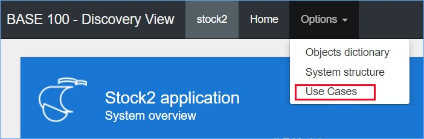
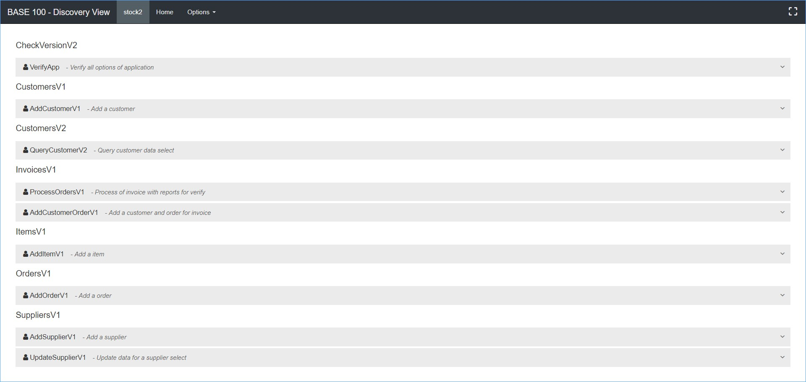
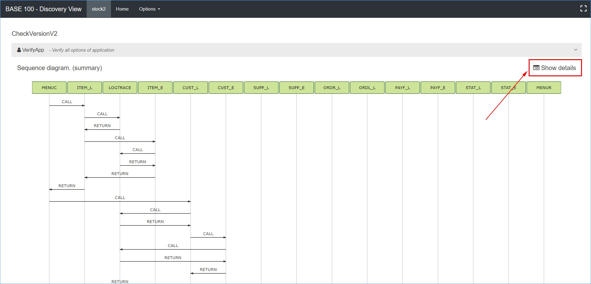
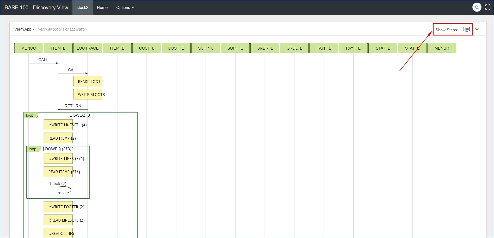
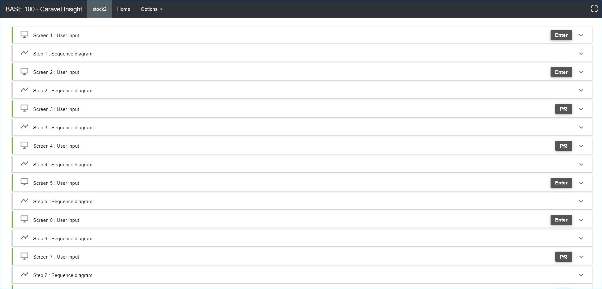
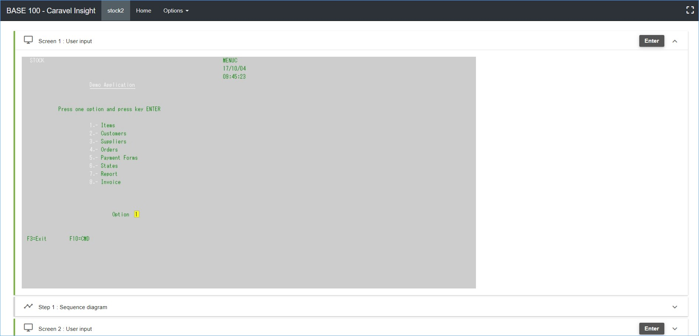
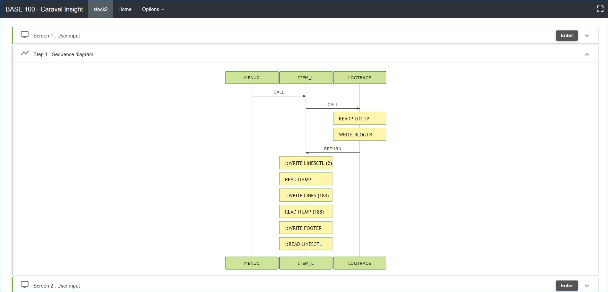

Se define como "**Use Cases**" a una sucesión de acciones dentro del Sistema que constituyen un proceso para cumplir una función. Es un mecanismo que permite reproducir el comportamiento del Sistema y analizar su funcionalidad. Corresponde a las operaciones que realizan los usuarios del Sistema en su trabajo con éste. _**Discovery View**_ permite gestionar los "**Use Cases**" que son generados previamente por la herramienta "_**Caravel Test Maker**_".

**_Discovery View_** permite el análisis de todos los "**Use Cases**" grabados en el Sistema. Se podrá ver en diferentes niveles de detalles logrando de esta manera una mejor compresión de los mismos. A continuación, se muestra el inicio correspondiente a esta página:

Como se puede observar en el inicio de esta página se muestra de manera ordenada un listado con todos los "**Use Cases**" del Sistema. Para empezar con el análisis se debe pulsar el icono  que se encuentra ubicado en la parte derecha de la descripción de cada "**Use Case**". A continuación, se muestra:

En esta primera parte del análisis se muestra un resumen del diagrama de secuencia, donde se ven reflejadas las diferentes interacciones que existen entre los elementos que componen este "**Use Case**". Para ver en detalle se debe pulsar el botón "**Show details**" como se muestra en la imagen anterior. A continuación, se muestra un ejemplo:

Al pulsar el botón "**Show Steps**" como se muestra en el recuadro rojo de la imagen anterior, se podrá acceder a un nivel de detalle máximo, mostrando el paso a paso del recorrido efectuado por el "**Use Case**" donde se reflejan también las pantallas que visualiza el usuario. A continuación, se muestra un ejemplo:

Como se puede observar cada paso está compuesto por un "**User input**" que se refiere a la entrada de datos por parte del usuario y un "**Sequence diagram**" que se refiere al diagrama de secuencia correspondiente en ese fragmento del "**Use Case**". A continuación, se muestra el "**User input**":

A continuación, se muestra el diagrama de secuencia correspondiente a este paso:

Se podrá hacer esto con cada "**Use Cases**" en el Sistema, el nivel de profundidad de en el análisis es llevado al más alto nivel de detalle para que se pueda obtener una mejor compresión de cada uno de estos.